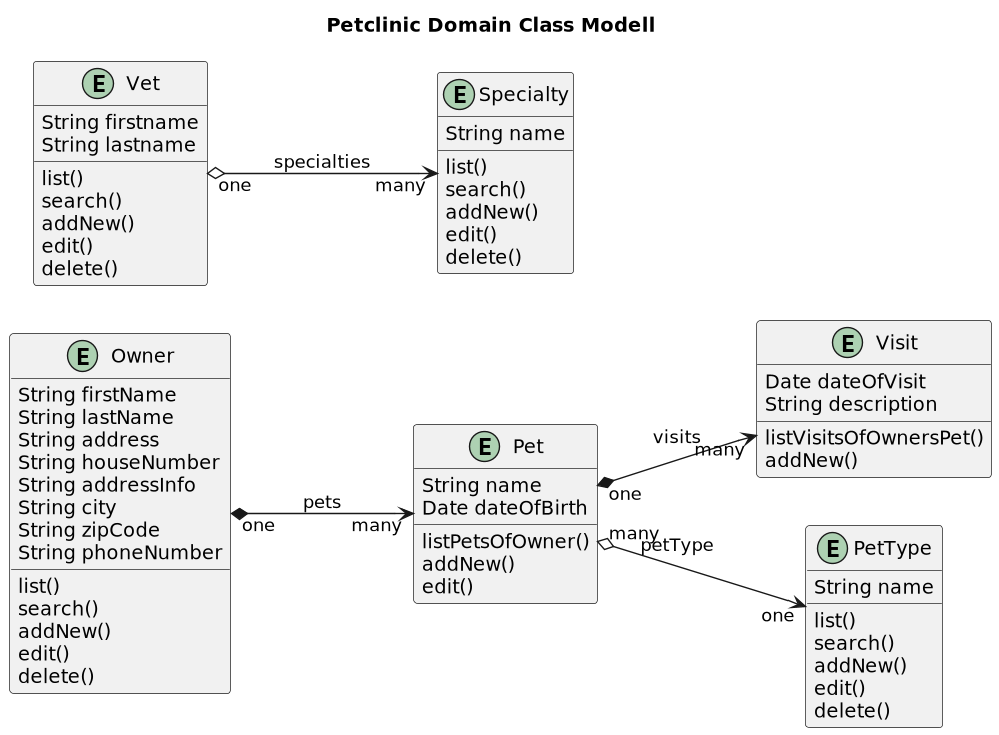

# Jakarta-EE-Petclinic

These Demo Application are planned to be a "Rosetta Stone" for compare OOP Web Application Frameworks like

* [Jakarta EE (Java)](https://jakarta-ee-petclinic.github.io/petclinic-jakartaee/)
* [Java EE 7](https://jakarta-ee-petclinic.github.io/petclinic-javaee7/)
* [Java EE 6](https://jakarta-ee-petclinic.github.io/petclinic-jee6/)
* [Symfony (PHP)](https://jakarta-ee-petclinic.github.io/petclinic_symfony/)
* [Django (Python)](https://jakarta-ee-petclinic.github.io/petclinic_django/)
* [Flask with SQLalchemy (Python)](https://jakarta-ee-petclinic.github.io/petclinic_flask/)
* [Spring Petclinic (Java)](https://github.com/spring-projects/spring-petclinic)
* [Fluid,Extbase (TYPO3-CMS, PHP)]()

Via OOA and OOD the functional Requirements should be extracted and divided from the nonfunctional Requirements
of the Frameworks:
* [Requirements Engineering (OOA,OOD,UML)](https://jakarta-ee-petclinic.github.io/petclinic-uml/)

* Most of the Frameworks compared here use Model-2 MVC Pattern for the Web/Presentation-Tier
  but Jakarta EE uses JSF (Java Server Faces), a Component Based Web/Presentation-Tier.

This Specification should also serve as Specification for non-Web Frontends like:
* [Qt (C++)]()
* [Qt (Python)]()
* [Java Swing]()

## Why Petclinic?

* The Domain Classes show all relationships like one-to-many (1:n), many-to-one (n:1) and many-to-many (n:m)
* It is simple enough but yet it shows more than just the CRUD Use Cases (Create, Read, Update, Delete) of most Demos and Training Examples.
* You can think of it as smallest complete Web App with the usual things to solve. 

